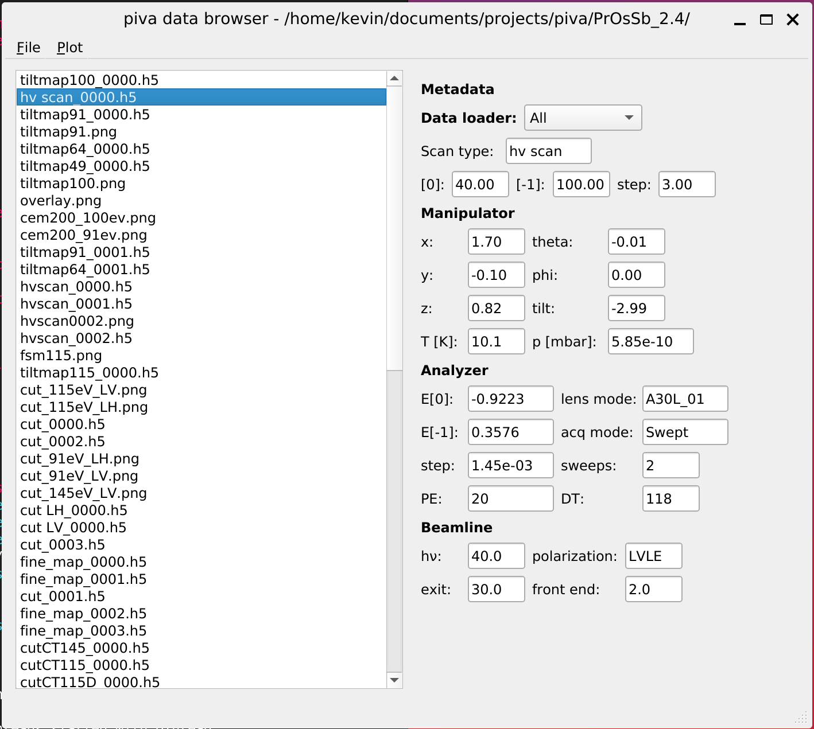

.. _sec-db:

``piva`` data browser (db)
==========================

Once installed, you can launch the ``piva`` data browser with the command::

    db

Alternatively, one can use::

    python -m piva.main

This brings up a window like the following:

The left half of this window provides a tree-view of your filesystem.
This allows you to browse throug your files using the mouse or arrow keys.
Whenever you select a :ref:`recognizable ARPES file <sec-file-formats>`, 
the databrowser will attempt to read its metadata and display it in the right 
half of the window.

.. note::
   If you know which dataloader will be suitable for your dataset, you can 
   select it from the dropdown at the top of the right half. This should 
   speed up metadata extraction and is generally safer than the default 
   option *All*.

The selected file can be opened in ``piva`` by choosing ``File -> Launch 
piva`` or by using the keyboard shortcut ``CTRL + L``.
Depending on the dimensionality/scan type this will launch either a :ref:`2D 
<sec-2d-viewer>` or :ref:`3D viewer <sec-3d-viewer>` in a new window.

