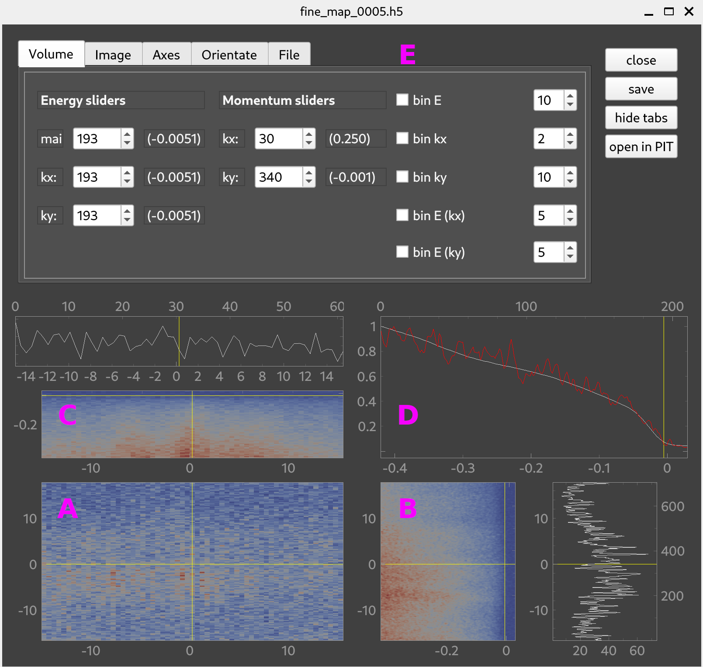

.. _sec-viewers:

Data viewers
============

.. _sec-3d-viewer:

3D viewer
---------

In this window three-dimensional ARPES data is displayed.
The layout should be familiar to anyone with experience with the Igor *Image 
Tool* that has been circulating in the ARPES community.

=====  =========================================================================
**a**  Main data plot. Like a *top view* of your data cube.
**b**  Cut through the data cube along the vertical yellow line in **a**.
**c**  Cut through the data cube along the horizontal yellow line in **a**.
**d**  Integrated intensity along the axis perpendicular to the plane in **a**.
**e**  *Utility panel*.
=====  =========================================================================

### The buttons

===========  ===================================================================
button       function
===========  ===================================================================
close        Close this window.
save         Save the dataset with all applied corrections and conversions as 
             a `pickle` file.
hide tabs    Hide the *utility panel* for a less distractive view.
open in PIT  Open the current dataset with `data-slicer's PIT <https://data-slicer.readthedocs.io/en/latest/quickstart.html>`_.
===========  ===================================================================

.. _sec-2d-viewer:

2D viewer
---------

This is used to display single *angle versus energy* ARPES spectra, as they are 
typically created by electron analyzers.

For the most part, this window is identical to its :ref:`3D counterpart 
<sec-3d-viewer>` except for the absence of an integrated intensity plot (**d**).
The *utility panel* also provides slightly different functionality, geared 
towards 2D datasets.
Therefore, confer the previous section for all things not covered here.

