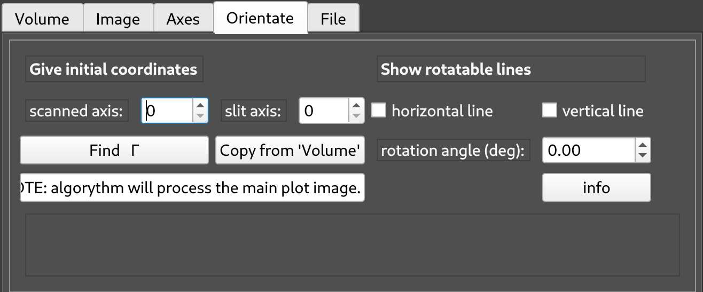

.. _sec-viewers:

Data viewers
============

.. _sec-3d-viewer:

3D viewer
---------

In this window three-dimensional ARPES data is displayed.
The layout should be familiar to anyone with experience with the Igor *Image 
Tool* that has been circulating in the ARPES community.

.. figure:: ../img/3dviewer_annotated.png
   :alt: Image not found.

=====  =========================================================================
**a**  Main data plot. Like a *top view* of your data cube.
**b**  Cut through the data cube along the vertical yellow line in **a**.
**c**  Cut through the data cube along the horizontal yellow line in **a**.
**d**  Integrated intensity along the axis perpendicular to the plane in **a**.
**e**  :ref:`Utility panel <sec-utility-panel3d>`.
=====  =========================================================================

The buttons
^^^^^^^^^^^

===========  ===================================================================
button       function
===========  ===================================================================
close        Close this window.
save         Save the dataset with all applied corrections and conversions as 
             a `pickle` file.
hide tabs    Hide the *utility panel* for a less distractive view.
open in PIT  Open the current dataset with `data-slicer's PIT <https://data-slicer.readthedocs.io/en/latest/quickstart.html>`_.
===========  ===================================================================

.. _sec-utility-panel3d:

The Utility Panel
^^^^^^^^^^^^^^^^^

The different tabs in this panel give access to a lot of `piva`'s functionality.

Volume
""""""

Here one can manually set the location (in pixels) of the yellow lines in the 
plots **a** - **d** (*Energy sliders* and *Momentum sliders*).

It's also possible to different integration windows by enabling the 
respective *binning* checkbox and setting the size of the window in units of 
pixels.

Image
"""""

.. figure:: ../img/image.png
   :alt: Image not found.

Visual aspects of the colormap can be adjusted here.
Normalization can be applied and a BZ contour can be overlayed over the data 
(requires :ref:`conversion to *k*-space first <sec-utility-panel-axes>`).

Finally, one can open the horizontal (**c**) and vertical (**b**) cuts in a 
new :ref:`2D viewer window <sec-2d-viewer>` for closer inspection.

.. _sec-utility-panel-axes:

Axes
""""

.. figure:: ../img/axes.png
   :alt: Image not found.

Here, the energy axis can be adjusted by manually setting the Fermi level 
and/or switching between binding and kinetic energy scales.

The remaining options allow conversion of angles to momentum *k*.
Put in the pixel coordinates of the location of the Brillouin zone center 
:math:`\Gamma` and the crystal's lattice parameters *a* (and *c* for 
additional *kz* conversion), select the analyzer slit geometry (*horizontal* 
or *vertical*) and click *Convert*.

The button *Copy from 'Orientate'* allows using the values for the location of 
:math:`\Gamma` found in the *Orientate* tab.

Orientate
"""""""""

This tab is intended to help with sample alignment, especially with azimuthal 
rotation.
One can manually input the pixel coordinates of the desired center of 
rotation (usually :math:`\Gamma`) or use an automated routine *Find* 
:math:`\Gamma`.
Then, rotatable lines can be overlayed to the plot to identify the sample 
azimuthal rotation.

File
""""

.. figure:: ../img/file.png
   :alt: Image not found.

With the *add/update* button, arbitrary metadata of the datafile can be added 
or changed.
The metadata will use the key entered in *name* and the value from *value*.

.. note::
    Any changes in the metadata will only be saved to the pickle file 
    generated/updated by hitting the *save* button in the top-right.

Finally, the *open in jn* button creates and opens a **J** upyter **n** 
otebook with the supplied name for further data analysis.

.. _sec-2d-viewer:

2D viewer
---------

This is used to display single *angle versus energy* ARPES spectra, as they are 
typically created by electron analyzers.

For the most part, this window is identical to its :ref:`3D counterpart 
<sec-3d-viewer>` except for the absence of an integrated intensity plot (**d**).
The *utility panel* also provides slightly different functionality, geared 
towards 2D datasets.
Therefore, confer the previous section for all things not covered here.

Utility Panel in 2D
^^^^^^^^^^^^^^^^^^^

Image
"""""

In addition to the functionality already present in the 3D case, one can 
employ a box smoothing algorithm and the *curvature method* for better 
visualization of dispersive features.

File
""""

Additionally allows opening this dataset in the  *MDC/EDC fitter* windows.

