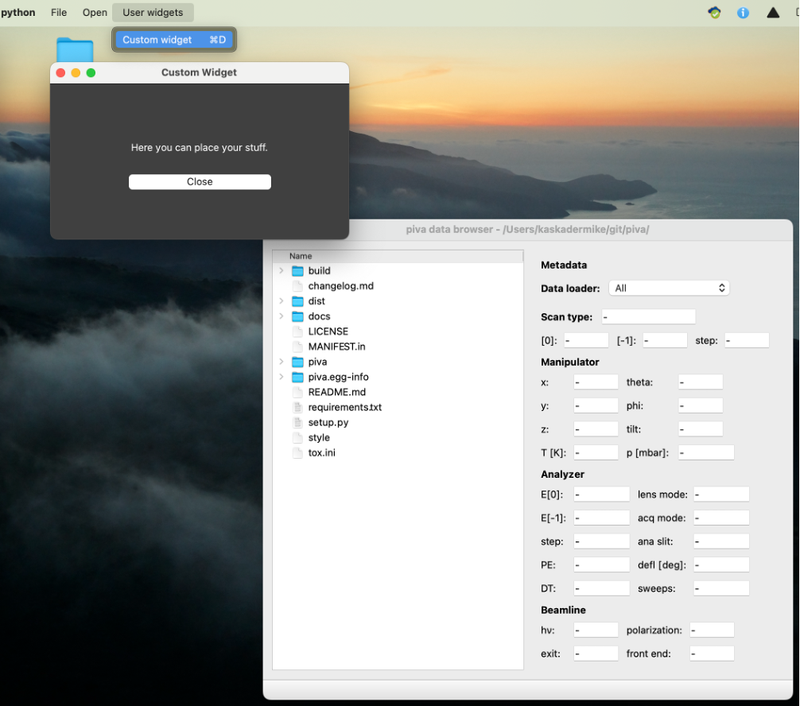

.. _sec-custom_plugins:

Custom Plugins
==============

The architecture of :mod:`piva` is designed with modularity in mind, enabling
users to implement their own plugins to perform a wide range of tasks and
extend the package's functionality.

Configuration of the custom written plugins is accomplished through
:class:`PluginImporter` object that must fulfill two requirements:

- :class:`PluginImporter` class must be defined in
  ``piva_plugin_importer.py`` module (python file)
- Path to the ``piva_plugin_importer.py`` needs to be added to the
  ``$PYTHONPATH`` of your virtual environment. A simple guide on how to do
  it on any operating system can be found `here <https://stackoverflow.com/
  questions/10738919/how-do-i-add-a-path-to-pythonpath-in-virtualenv>`_.

At the start of each session, :mod:`piva` searches for the
:mod:`piva_plugin_importer` module, attempts to import the
:class:`PluginImporter` class, and executes whatever code it contains.
This may include new visualization tools, data transformation routines, and
more.

The most basic implementation of the :class:`PluginImporter` and an example
:class:`CustomWidget` can be downloaded from the links below:

- :download:`PluginImporter <../misc/piva_plugin_importer.py>`
- :download:`CustomWidget <../misc/custom_widget1.py>`

This example creates a simple window (shown below) that can be opened
from the menu bar.

User Contributions
------------------

Everyone is highly encouraged to share tested, self-written custom widgets with
the world by adding it to :mod:`piva`'s source code. This is ideally done
`directly through github  <https://github.com/pudeIko/piva>`_ or
alternatively by contacting the development team:

.. include:: contact.rst

