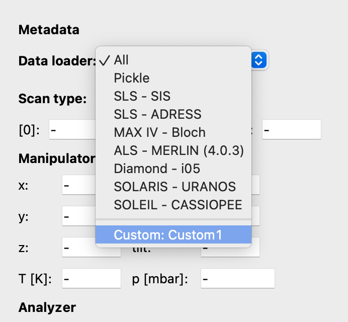
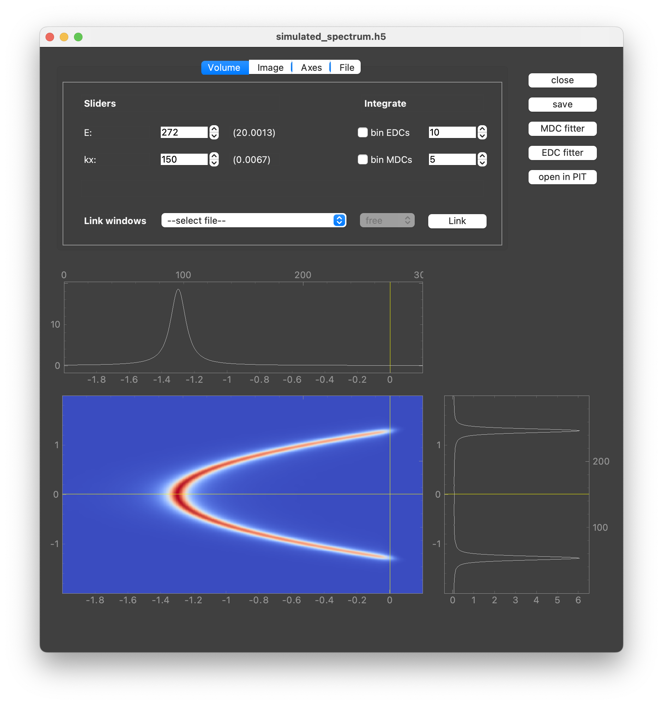

.. _sec-dataloaders:

Data loaders
============

As emphasized in :ref:`Data format <sec-dataset>` section, different
experimental setups return different file formats. To handle those
discrepancies, :ref:`data_loaders <sec-data-loaders-file>` module implements
objects that take care of a proper data extraction and returns
:class:`data_loaders.Dataset`, recognizable by the rest of the package.

It provides the :class:`~data_loaders.Dataloader` class as a base structure
for different sources (beamlines, electron analyzers, labs) and a number of
specific **Dataloader** dedicated to various ARPES beamlines around the world
(full list is shown in a table below).

Principles of the data import in :mod:`piva` are presented on a simple scheme
below.

.. figure:: ../img/dl-scheme.png
    :alt: Image not found.

If the file format is not yet supported, one needs to implement a custom
**Dataloader** and make it accessible for :mod:`piva`. Detailed guidelines on
how to do it can be found in section
:ref:`"Writing custom Dataloader" <sec-custom-dl>`.

.. _sec-dl-list:

Implemented Dataloaders
-----------------------

Table below shows list of **Dataloader** corresponding to light sources and
data formats currently implemented within :mod:`piva`, along with the most
recent dates when the **Dataloader** was tested.

.. table::
   :widths: auto

   ===========  ========  ========  =======================  ==================
   Dataloader   Facility  Date      File formats             Comments
   ===========  ========  ========  =======================  ==================
   Pickle       --        Oct 2023  - :mod:`pickle` files    files saved with
                                                             :mod:`piva`
   SIS          SLS       Oct 2023  - Scienta SES files      --
                                      (**.zip**, **.ibw**,
                                      **.pxt**)
                                    - HDF file (**.h5**)
   ADRESS       SLS       Aug 2023  - HDF file (**.h5**)     --
   Bloch        MAX IV    Oct 2023  - Scienta SES files      --
                                      (**.zip**, **.ibw**,
                                      **.pxt**)
   MERLIN       ALS       Apr 2023  - Scienta SES files      --
                                      (**.zip**, **.ibw**,
                                      **.pxt**)
                                    - HDF file (**.h5**)
   i05          Diamond   Nov 2022  - NeXus (**.nxs***)      --
   URANOS       Solaris   Apr 2023  - Scienta SES files      --
                                      (**.zip**, **.ibw**,
                                      **.pxt**)
   CASSIOPEE    Soleil    Oct 2023  - Scienta SES files      --
                                      (**.zip**, **.ibw**,
                                      **.pxt**)
                                    - Text files (**.txt**)
   ===========  ========  ========  =======================  ==================

.. _sec-custom-dl:

Writing a custom **Dataloader**
-------------------------------

In order to implement custom **Dataloader** one needs to:

1. write a loading script,
2. make it available for :mod:`piva`.

Description below shows step by step how to achieve both.

1. A :mod:`piva` dataloader is nothing else than a subclass of
   :class:`~data_loaders.Dataloader` that takes care of three things:

    - Reading an ARPES data file.
    - Extracting all relevant data and metadata from loaded file.
    - Creating :class:`~data_loaders.Dataset` object and filling it with so
      extracted data.

   The :class:`~data_loaders.Dataloader` class offers an interface for that.
   In order to write a custom dataloader, let's call it
   :class:`CustomDataloader`, one needs to start by creating a subclass of
   :class:`~data_loader.Dataloader`::

    from piva.data_loaders import Dataloader

    class CustomDataloader(Dataloader):
        name = 'Custom1'

        def __init__(self):
            super(CustomDataloader1, self).__init__()

   Such defined subclass **has to** contain a ``load_data()`` method, returning
   :class:`~data_loaders.Dataset` object under ``self.ds`` attribute::

        def load_data(self, filename, metadata=False):
            # <Your code here>
            # 1) Read in data from *filename*
            # 2) Extract necessary (meta)data
            # 3) Put it into an argparse.Namespace and return it
            return self.ds

   .. note::
        Both:
           - ``filename``, :obj:`str`, absolut path to the file
           - ``metadata``, :obj:`bool`, determine whether method should load
             entire dataset or just its metadata

        have to be arguments of the ``load_data()`` method. See
        :meth:`~data_loaders.DataloaderPickle.load_data` for more details.

   .. note::
        The above example describes the most basic implementation necessary to
        work. It is recommended to use prepared template, which can be
        downloaded from :download:`here <../misc/custom_data_loaders.py>`.

   .. seealso::
      See :meth:`~data_browser.DataBrowser.load_custom_data_loaders` for more
      details.

2. Making **CustomDataloader** visible for :mod:`piva` is accomplished through
   :class:`DataloaderImporter` object. Its proper configuration requires
   following conditions:

    - The module (python file) in which :class:`DataloaderImporter` is defined
      **must** be called ``piva_dataloader_importer.py``.
    - Path to the ``piva_dataloader_importer.py`` needs to be added to the
      ``$PYTHONPATH`` of your virtual environment. A simple guide on how to do
      it on any operating system can be found `here <https://stackoverflow.com/
      questions/10738919/how-do-i-add-a-path-to-pythonpath-in-virtualenv>`_.

   At the beginning of the session, :mod:`piva` will search for the
   :class:`DataloaderImporter` class and execute whatever code it contains.
   Correctly loaded **CustomDataloader** should appear in **DataBrowser's**
   drop-down menu:

.. note::
    The advantage of this approach is that the ``piva_dataloader_importer.py``
    module and **CustomDataloaders** can be stored in any directory, without
    modifying the :mod:`piva` package. Moreover, once correctly implemented,
    the loader will be automatically imported at the beginning of each
    :mod:`piva` session and available to the user immediately.

.. _sec-custom-dl-example:

Example
-------
Users are free to implement custom data loaders according to their
preferences. However, they may find the provided template
:download:`here <../misc/piva_dataloader_importer.py>` helpful.
The template offers a basic implementation of the :class:`DataloaderImporter`
and :class:`CustomDataloader` classes.

Additionally, the template can be used to test the configuration with an
example :download:`spectrum file <../misc/simulated_spectrum.h5>`, which
contains a simulated 2D spectrum:

Contributing
------------

We encourage everyone to share their tested, self-written data loaders with
the community by adding them to :mod:`piva`'s source code. This can be done
ideally `directly through GitHub <https://github.com/pudeIko/piva>`_ or
alternatively by contacting the development team:

.. include:: contact.rst
