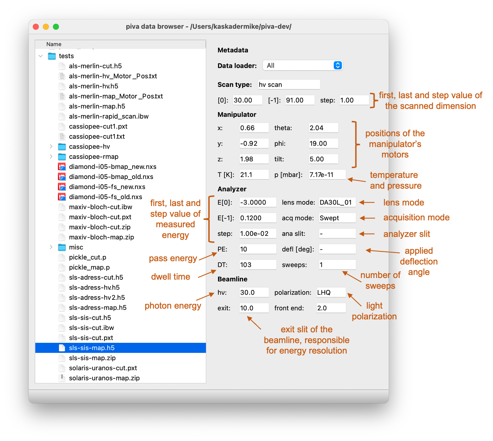

.. _sec-db:

Data Browser
============

**DataBrowser** is a main window of the :mod:`piva` package. To open it, in
terminal simply run::

    db

This will start :mod:`piva` session and open the following window:

- Left-hand side of the window provides a **tree-view** of the filesystem,
  allowing to browse through the files.

  Currently displayed directory can be changed from menu bar (**File** ->
  **Open directory**) or by using the ``CTRL + O`` shortcut.

- On the right-hand side one can see the metadata panel, displaying all
  metadata available in loaded file. Whenever file selection in the
  **tree-view** changes, DataBrowser will attempt to read its metadata and
  display it in the corresponding fields. See also
  :class:`~data_loaders.Dataset` for more details.

  To open selected file go to menu bar (**File** -> **Launch piva**) or use
  the ``CTRL + L`` shortcut.

  .. note::
    Default :class:`~data_loaders.Dataloader` selection set to `All` (dropdown
    menu at top of the **metadata panel**) attempts to load selected file by
    iterating through all implemented Dataloaders. As a consequence, it can
    succeed loading :class:`~data_loaders.Dataset` but with limited number of
    metadata. Selecting suitable :class:`~data_loaders.Dataloader` makes sure
    all available metadata are extracted and speeds up loading time.

  Depending on the dimensionality/scan type this will launch either a
  :ref:`2D <sec-2d-viewer>` or :ref:`3D Viewer <sec-3d-viewer>` in a new
  window.

