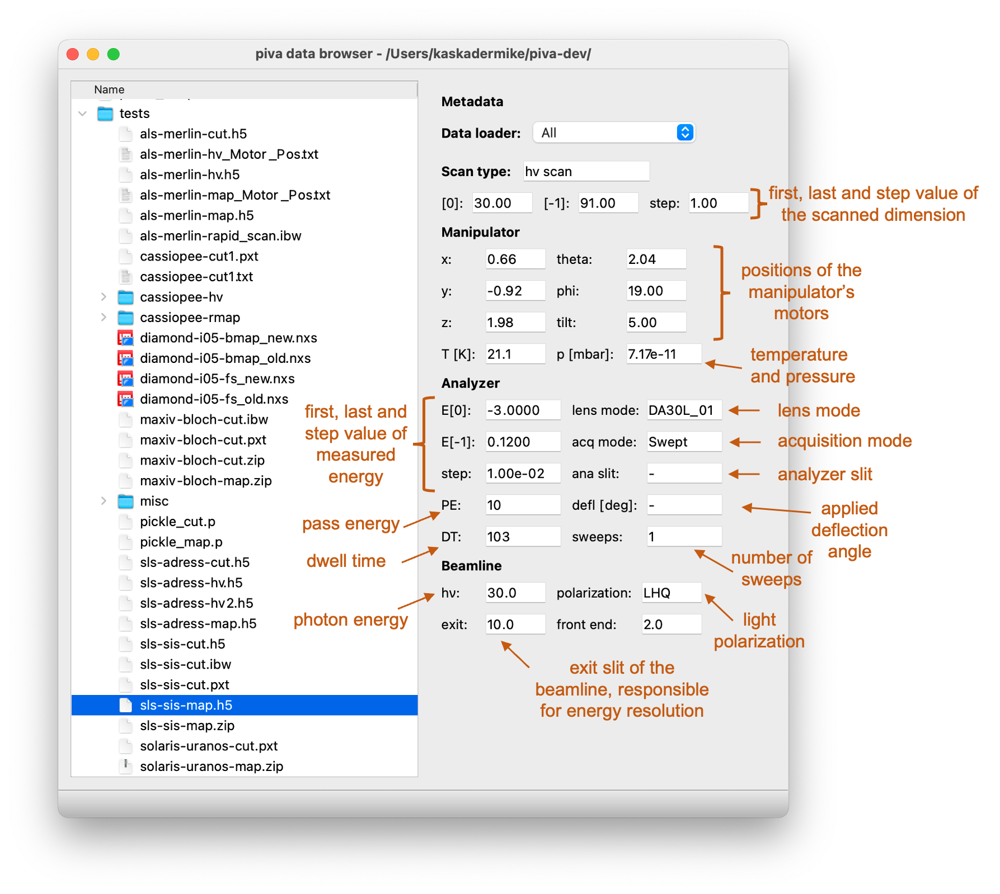

.. _sec-db:

Data Browser
============

**DataBrowser** is the main window of the :mod:`piva` package. To open it,
simply run::

    piva

in the terminal. This will start a :mod:`piva` session and open the following
window:

- The left-hand side of the window provides a **tree-view** of the filesystem,
  allowing you to browse through the files.

  The currently displayed directory can be changed from the menu bar
  (**File** -> **Open directory**) or by using the ``CTRL + O`` shortcut.

- On the right-hand side, you can see the metadata panel, displaying all
  metadata available in the loaded file. Whenever the file selection in the
  **tree-view** changes, DataBrowser will attempt to read its metadata and
  display it in the corresponding fields. See also
  :class:`~data_loaders.Dataset` for more details.

  To open the selected file, go to the menu bar (**File** -> **Launch piva**)
  or use the ``CTRL + L`` shortcut.

  .. note::
    The default :class:`~data_loaders.Dataloader` selection set to `All`
    (dropdown menu at the top of the **metadata panel**) attempts to load the
    selected file by iterating through all implemented Dataloaders. As a
    result, it can succeed in loading :class:`~data_loaders.Dataset` but with
    a reduced amount of metadata. Selecting a suitable
    :class:`~data_loaders.Dataloader` ensures all available metadata are
    extracted and speeds up the loading time.

  Depending on the dimensionality/scan type this will launch either a
  :ref:`2D <sec-2d-viewer>`, :ref:`3D <sec-3d-viewer>` or
  :ref:`4D Viewer <sec-4d-viewer>` in a new window.