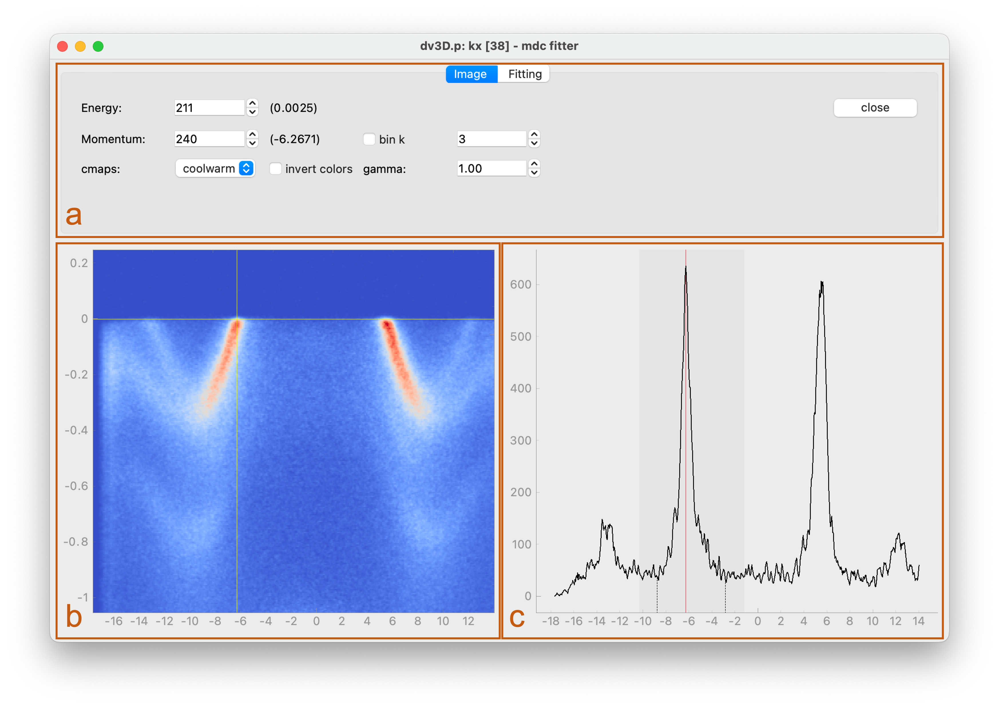
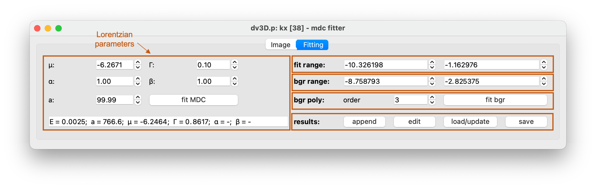
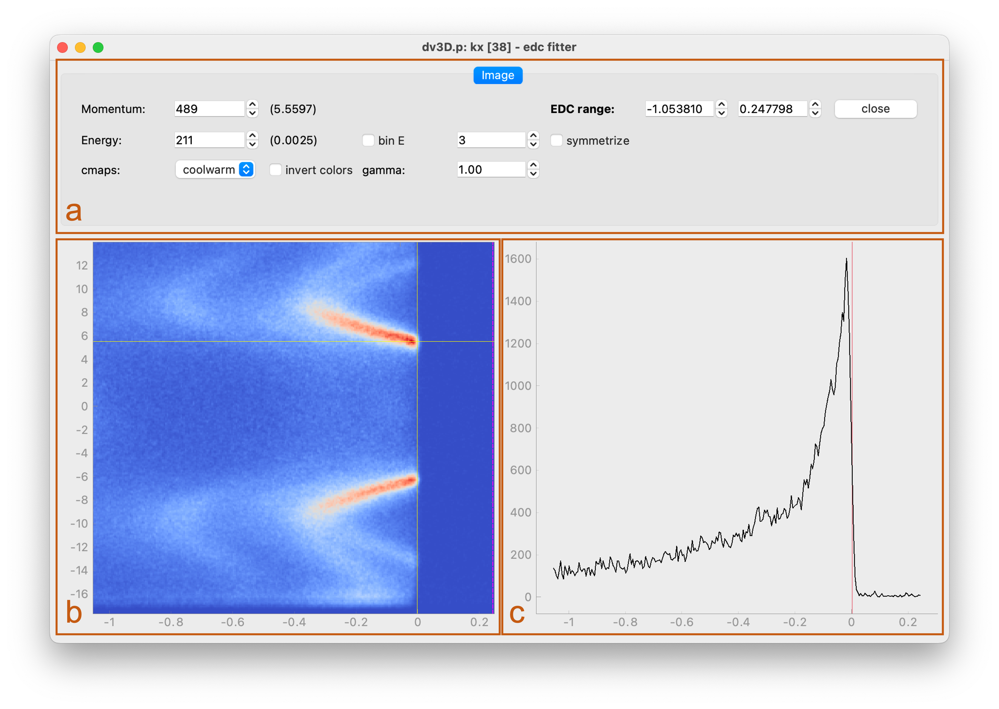

.. _sec-fitters:

Fitters
=======

Two-dimensional datasets can be opened in available **Fitters**. These GUI
applications contain standard data processing technics and constitute
additional utility allowing for more detailed inspection and quantitative
analysis of investigated data.

Two, :ref:`MDC <sec-mdc-fitter>` and :ref:`EDC <sec-edc-fitter>` **Fitters**
are implemented within :mod:`piva`, including methods useful when dealing
with *momentum* and *energy distribution curves*, respectively.

.. _sec-mdc-fitter:

MDC Fitter
----------

**MDC Fitter** allows to investigate *momentum distribution curves* (MDCs)
across available energy range. User interactively can perform subtraction of
polynomial background and fit (asymmetric) Lorentzian line shape within
selected fitting range.

Its layout is shown and described below.

=====   =======================================================================
**a**   **Utilities panel**, see description :ref:`below <sec-mdc-util-panel>`.
**b**   **Main data panel** showing investigated 2D dataset. Contains sliders
        allowing to slice through data.
**c**   **MDC panel** extracted at the energy selected with a slider in
        **main data panel**.
=====   =======================================================================

.. _sec-mdc-util-panel:

MDC Fitter's Utilities Panel
^^^^^^^^^^^^^^^^^^^^^^^^^^^^

**Utilities panel** contains all image processing and analysis features.

Image tab
"""""""""

Combines widgets and functionalities of
:ref:`volume <sec-utilities-panel-volume>` and
:ref:`image <sec-utilities-panel-image>` tabs of the
:ref:`DataViewers <sec-viewers>`.

Fitting tab
"""""""""""

Contains all widgets useful for interactive fitting of MDCs.

=======================     ===================================================
Lorentzian's parameters     - :math:`\mu` - expected value,
                            - :math:`\Gamma` - full width at half maximum,
                            - :math:`\alpha, \beta` - asymmetry factors of
                              fitted line shape,
                            - :math:`a` - normalization factor.

                            Box at the bottom displays fit results.
fit range                   Set fitting range, displayed as a grey shadow on
                            **MDC panel**.
bgr range                   Set background range, indicated with two vertical
                            dashed lines on **MDC panel**. The region between
                            the lines (which supposed to contain entire peak)
                            will be excluded during background fitting.
bgr poly                    Select order of the background polynomial.
results                      - *append* fit results (expected value) on the
                               **Main data panel** and store results in
                               **Fitters** memory.
                             - *edit* collected results; opens ``txt``
                               file with saved parameters.
                             - *load* saved or *update* edited parameters.
                             - *save* fitted parameters to ``txt`` file.
=======================     ===================================================

.. _sec-edc-fitter:

EDC Fitter
----------

**EDC Fitter** allows to investigate *energy distribution curves* (EDCs) and
perform gap analysis.

Its layout is shown and described below.

=====   =======================================================================
**a**   **Utilities panel**, see description :ref:`below <sec-mdc-util-panel>`.
**b**   **Main data panel** showing investigated 2D dataset. Contains sliders
        allowing to slice through data.
**c**   **EDC panel** extracted at the momentum selected with a slider in
        **main data panel**.
=====   =======================================================================

.. _sec-edc-util-panel:

EDC Fitter's Utilities Panel
^^^^^^^^^^^^^^^^^^^^^^^^^^^^

I addition to basic functionalities of :ref:`volume
<sec-utilities-panel-volume>` and :ref:`image <sec-utilities-panel-image>`
tabs of the :ref:`DataViewers <sec-viewers>`, **EDC Fitter** allows to narrow
energy range and symmetrize EDCs around the Fermi level.

Development
-----------

At the moment only basic methods are implemented within :mod:`piva`
**Fitters**, leaving a large playground for improvement. Users are highly
encouraged to contribute and extend their capabilities or implement
:ref:`entirely new widgets <sec-custom_widgets>`. This can be done directly
through `github  <https://github.com/pudeIko/piva>`_ or alternatively by
contacting the development team:

.. include:: contact.rst

