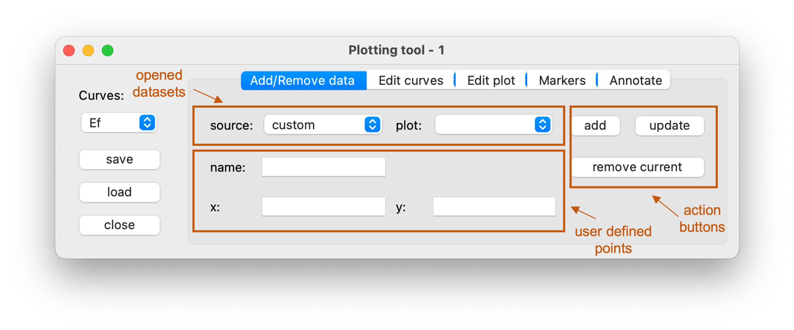
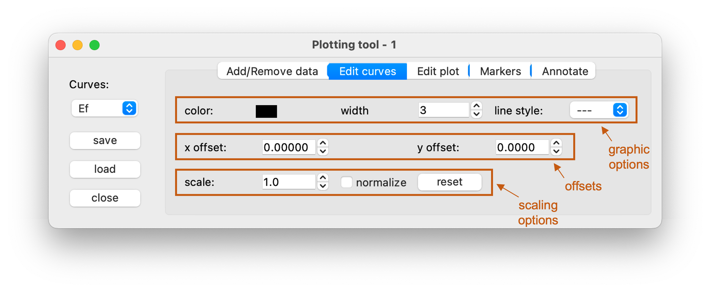
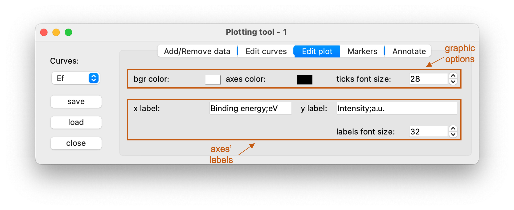
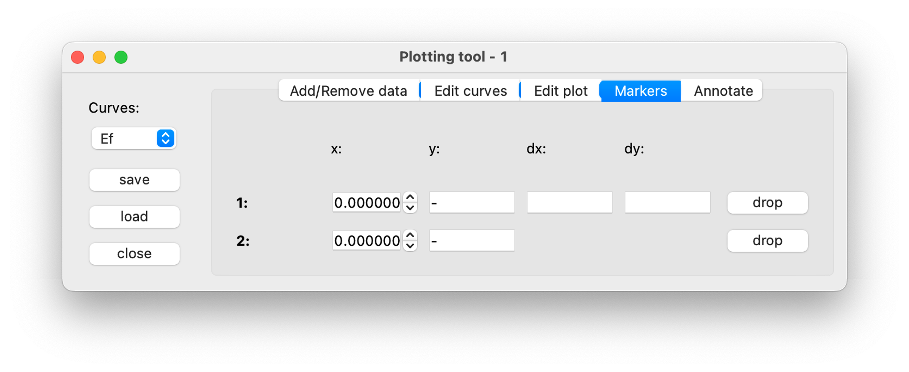
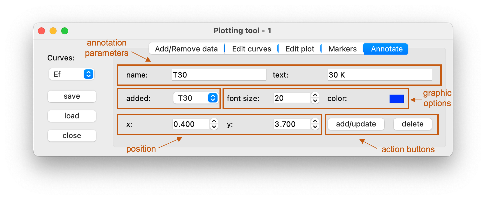
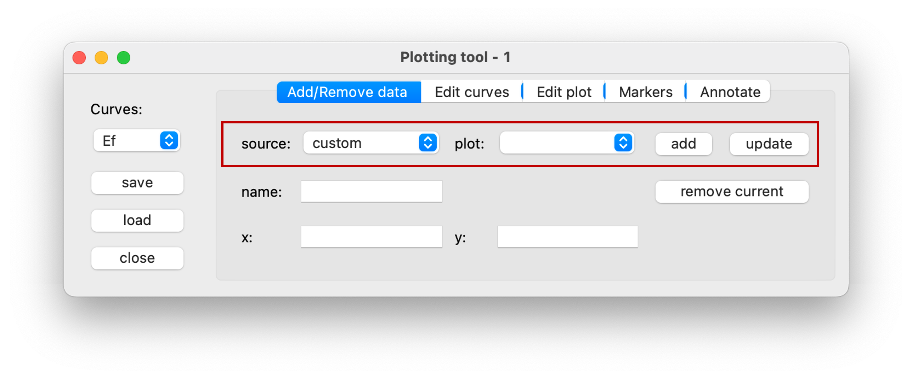
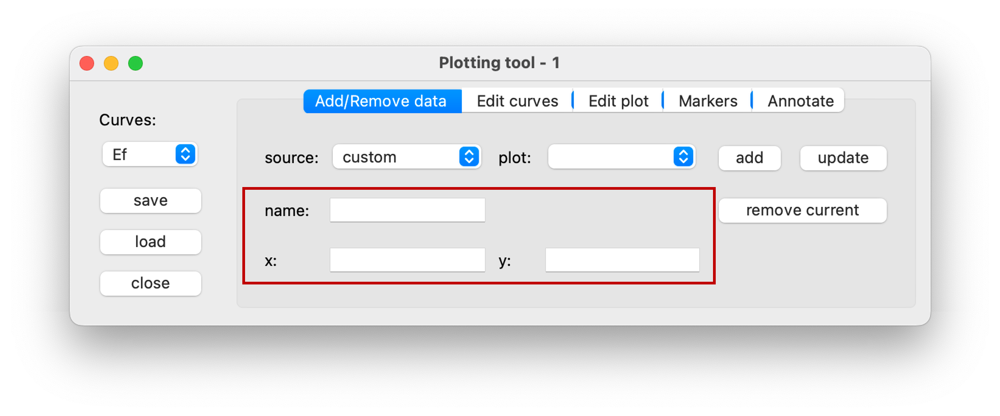
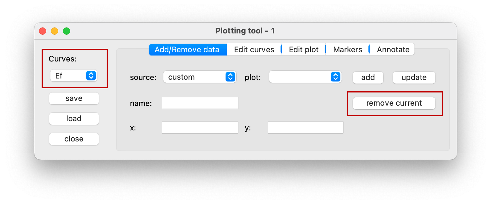

.. _sec-plottool:

Plot Tool
=========

**PlotTool** is an utility allowing for plotting multiple curves together.
Every 1D set of data displayed currently on **DataViewers** or **Fitters** can
be imported and further processed to compare differences between results
obtained under, *e.g*, different conditions.

To open **PlotTool** window one can simply use a ``CTRL + P`` (``CMD + P`` on 
macOS) shortcut or access it from menu bar of the :ref:`DataBrowser <sec-db>`.

Its overall layout is shown below.

.. figure:: ../img/fitters_plottool/plottool-main.png
   :alt: Image not found.

=====   =======================================================================
**a**   - **Curves** dropdown menu contains list of all currently loaded
          curves. By selecting corresponding curve one can change its
          properties in other tabs.
        - **save** button allows to save current plot as an image, or entire
          session as a pickle file, which can be loaded later on.
        - **load** button allows to load previously loaded **PlotTool**
          session.
        - **close** button closes the window.
**b**   **Utilities panel**, described in more detail :ref:`below <sec-pt-up>`.
**c**   **Plot panel** displaying loaded and edited curves.
=====   =======================================================================

.. _sec-pt-up:

Plot Tool's Utilities Panel
---------------------------

**Utilities panel** allows for managing datasets, editing their appearance
and many other functionalities helpful in creating easy to read plots.

Functionalities included in different tabs are described below.

Add/Remove data tab
^^^^^^^^^^^^^^^^^^^

Allows for general management over imported data.

===================     =======================================================
opened datasets         Select dataset to import:

                        - **source** - dropdown menu containing list of all
                          currently opened **DataViewers** and **Fitters**.
                          Option *custom* allows to add *user defined points*.
                        - **plot** - dropdown menu containing a list of all
                          curves possible to import. Available options are
                          based on selection of the **source**, *e.g* when **3D
                          DataViewer** is selected list includes: *main
                          edc, single point edc, vertical (analyzer)* and
                          *horizontal (scanned)*.
user defined points     If **source** selection is set to *custom*, one can
                        simply add curve to plot by hand. *x* and *y* points
                        must be given as a list of numbers separated by
                        ``space``. **Name** specifies a label by which curve
                        will be saved and stored in **Curves** list.
action buttons          - **add** data based on current **source** and
                          **plot** selection.
                        - **update** list of **source** dropdown menu. When
                          initializing **PlotTool** window, list contains all
                          currently opened **DataViewers** and **Fitters**; if
                          a new one is opened, **source** list needs to be
                          updated.
                        - **remove** curve based on the current selection of
                          the **Curves** list on the left side (outside of the
                          **Utilities panel**).
===================     =======================================================

Edit curves tab
^^^^^^^^^^^^^^^

Helps to adjust and personalize appearance of the imported curves. All changes
made in this tab are performed on a curve currently selected in the **Curves**
list.

===============     ===========================================================
graphic options     Change visual parameters (color, line width and its style)
                    of the selected curve.
offsets             Apply offsets to the dataset along *x* and *y* directions.
scaling options     Scale by a constant or normalize data.
===============     ===========================================================

Edit plot tab
^^^^^^^^^^^^^

Helps to adjust and personalize overall appearance of the plot.

===============     ===========================================================
graphic options     Change visual parameters (background color, axes color and
                    ticks font size) of the plot.
axes' labels        Set labels of the axes and their font size.
===============     ===========================================================

.. note::

    While specifying labels, separating description and units with a semicolon
    automatically formats the label from "`descr`;`units`" to "`descr`
    (`units`)". Moreover, :mod:`pyqtgraph` scales an axis with an appropriate
    prefix (kilo, mili, micro, *etc.*).

Markers tab
^^^^^^^^^^^

**Drop** buttons append movable markers on the currently selected curve.

Sliding markers across the curve helps to read exact position (*x* and *y*) of
fine features on the plot and display differences between their positions
(*dx* and *dy*) along the corresponding direction.

Annotate tab
^^^^^^^^^^^^

Allows to append text annotations on the plot to include some useful
information.

=====================   =======================================================
annotation parameters   - **name** - label of an annotation in **added** list,
                        - **text** - annotation text.
added                   Dropdown menu containing list of added annotations.
                        Editing is performed on currently selected one.
graphic options         Change visual parameters (color and font size) of the
                        text.
position                Set position of the annotation in data coordinates.
action buttons          - **add** new or **update** selected annotation,
                        - **delete** selected annotation.
=====================   =======================================================

.. note::

    Many more options are embedded in :class:`pyqtgraph.PlotWidget` object and
    can be accessed by clicking on the panel with a right mouse button.

.. _sec-pt-hts:

How to start
------------

Adding curves
^^^^^^^^^^^^^

The **Add/Remove Data** tab in the **Utilities Panel** allows you to manage 
the curves displayed in the **Plot Panel**.

You can import and plot any 1D data currently shown in open **DataViewers** or 
**Fitters**. To add a new curve, first specify its origin using the **source** 
and **plot** dropdown menus.

- The **source** menu lists all open **DataViewers** and **Fitters**. 
  Note: This list reflects the state at initialization — click the **update** 
  button to refresh it after loading new data files.
- The **plot** menu displays the available 1D curves within the selected 
  source. Its content depends on the type of viewer or fitter, *eg.*:

    - In the case of a :ref:`2D Viewer <sec-2d-viewer>`, options include *edc* 
      and *mdc*.
    - For a :ref:`3D Viewer <sec-3d-viewer>`, options include *main edc*, 
      *single-point edc*, *vertical (analyzer)*, and *horizontal (scanned)*.

Once the desired data is selected, click the **add** button to display the 
curve in the **Plot Panel**.

Alternatively, you can add custom data. To do this, select **custom** from the 
**source** dropdown menu (the **plot** menu will then be empty).
Provide a **name** for your data entry and enter a list of **x** and **y** 
values separated by a single space.

Click **add** as before to plot the curve.

Removing and editing curves
^^^^^^^^^^^^^^^^^^^^^^^^^^^

To remove a curve, first check the **Curves** dropdown menu on the left-hand 
side, which lists all currently imported and plotted curves.
Ensure the correct entry is selected, then click the **remove current** button.

Similarly, selecting a curve from the **Curves** list is required for editing 
or adding markers, as it puts the curve into an "editable" state.
Once selected, any changes made in the **Edit Curves** or **Markers** tabs 
will apply to that specific curve, allowing you to modify the display of each 
curve individually.
