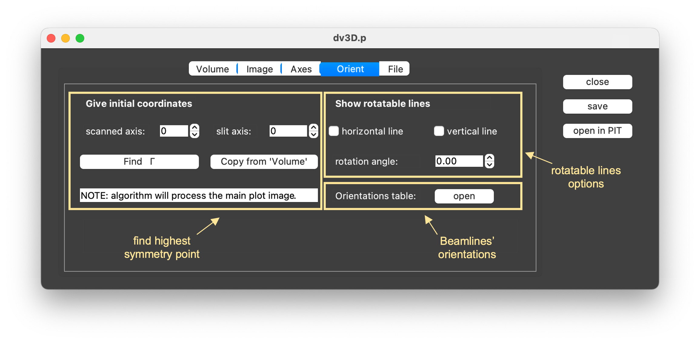

.. _sec-viewers:

Data Viewers
============

.. _sec-2d-viewer:

2D DataViewer
-------------

This viewer allows for processing two-dimensional *energy vs. momentum*
datasets that are basic detector's images acquired during ARPES experiment.

The window consists of two main objects: :class:`~data_viewer_2d.DataViewer2D`
and :class:`~utilities_panel.UtilitiesPanel`, responsible for
slicing/displaying updated plots and manipulation on the data, respectively.
Its layout and components are described below:

.. _sec-2d-viewer-table:

=====   =======================================================================
**a**   **Main data plot**. Horizontal and vertical axes correspond to the
        energy and angle (momentum) directions, respectively.
**b**   Horizontal and vertical slices taken at the positions of the sliders.
**c**   Utilities panel containing all image processing and analysis features,
        to large extent shared between :ref:`2D <sec-2d-viewer>`,
        :ref:`3D Viewer <sec-3d-viewer>` and :ref:`4D Viewer <sec-4d-viewer>`.
        Detailed description of all its options can be found
        :ref:`below <sec-utilities-panel>`.
**d**    - **close** - close this window
         - **save** - save current dataset to a :mod:`pickle` file.
         - **open in PIT** - open current dataset with `data-slicer's PIT
           <https://data-slicer.readthedocs.io/en/latest/quickstart.html>`_.
         - **MDC fitter** - open current dataset in :ref:`MDC Fitter
           <sec-mdc-fitter>`
         - **EDC fitter** - open current dataset in :ref:`EDC Fitter
           <sec-edc-fitter>`
=====   =======================================================================

.. note::
    **save** button saves applied energy corrections and *k*-space
    conversion but does not keep information on performed image processing
    like smoothing or curvature analysis.

.. _sec-3d-viewer:

3D DataViewer
-------------

During the measurement, *energy vs. momentum* images are very often acquired
as a function of a third parameter, *e.g.* rotation angle or photon energy.
:ref:`3D Viewer <sec-3d-viewer>` allows for inspection of such datasets.
Window's layout helps to simultaneously and intuitively present slices across
all three perpendicular directions.

=====   =======================================================================
**a**   **Main image plot**. Horizontal and vertical axes correspond to scanned
        dimension and analyzer (angle/momentum) axis, respectively.
**b**   Horizontal and vertical cuts taken along the sliders in
        **main image plot**. Vertical axes correspond to energy, horizontal to
        corresponing axes of **main image plot**.
**c**   Slices taken along energy sliders of horizontal/vertical cuts.
**d**   Utilities panel containing all image processing and analysis features,
        to large extent shared between :ref:`2D <sec-2d-viewer>`,
        :ref:`3D Viewer <sec-3d-viewer>` and :ref:`4D Viewer <sec-4d-viewer>`.
        Detailed description of all its options can be found
        :ref:`below <sec-utilities-panel>`.
**e**   See description :ref:`here <sec-2d-viewer-table>`.
=====   =======================================================================

.. _sec-4d-viewer:

4D DataViewer
-------------

Micro- and nano-ARPES are methods interested in examining physically small
systems, like microscopic crystallographic domains, nano-structures or
fabricated devices. They use special focusing optics to minimize beam spot size
and obtain information about how band structure varies between different
regions of the sample. :ref:`4D Viewer <sec-4d-viewer>` is a convenient tool
for visualizing such datasets, acquired by rastering the beam over the sample's
surface and spatially resolving electronic dispersion.

=====   =======================================================================
**a**   **Raster scan plot**. Horizontal and vertical axes correspond to the
        translation of the manipulator. Each data point represents spectrum
        acquired at the given position. Details on the representation can be
        found in :meth:`~data_viewer_4d.DataHandler4D.update_raster_data`
**b**   **Band map plot**. Horizontal and vertical axes correspond to the
        energy and angle (momentum) directions, respectively.
**c**   Horizontal and vertical slices taken at the positions of the sliders.
**d**   Utilities panel containing all image processing and analysis features,
        to large extent shared between :ref:`2D <sec-2d-viewer>`,
        :ref:`3D Viewer <sec-3d-viewer>` and :ref:`4D Viewer <sec-4d-viewer>`.
        Detailed description of all its options can be found
        :ref:`below <sec-utilities-panel>`.
**e**   See description :ref:`here <sec-2d-viewer-table>`.
=====   =======================================================================

.. _sec-utilities-panel:

The Utilities Panel
-------------------

The top panel of the **DataViewers**, consists of different tabs, which give
access to :mod:`piva`'s functionalities. **Utilities Panels** of
:ref:`2D <sec-2d-viewer>`, :ref:`3D Viewers <sec-3d-viewer>` and
:ref:`4D Viewers <sec-4d-viewer>` share a lot of similarities and, therefore,
are discussed on example of ``dv2D.p`` and ``dv3D.p`` windows.

.. _sec-utilities-panel-volume:

Volume tab
^^^^^^^^^^

Gives additional control over the sliders and allows to integrate data.
Helps to better orient on both levels: data matrix and experimental
coordinates.

===============  ==============================================================
Functionality    Description
===============  ==============================================================
positions        Set manually the location (in pixels) of the *Energy* and
                 *Momentum sliders*.
binning options  Apply integration window by enabling the respective *binning*
                 checkbox and setting the size of the window in units of
                 pixels.
linking options  Link different **DataViewers** (of the same type) to control
                 their sliders simultaneously.

                 Functionality operates in a `parent`-`child` system, where
                 one (`parent`) window controls all the others. `Parent`
                 window is established as the window from which *Link*
                 button was clicked. All other windows receive status
                 `child`. Windows added to existing linked combination will
                 also receive status `child`.
===============  ==============================================================

.. _sec-utilities-panel-image:

Image tab
^^^^^^^^^

Controls visual aspects of displayed images, from simple colormap
selection and color scaling to more advanced processing methods.

======================  =======================================================
Functionality           Description
======================  =======================================================
colors                  Select :mod:`matplotlib` colormap, invert its colors,
                        apply power-law normalization according to :math:`x
                        \rightarrow x^{1/\gamma}`.
normalization options   Apply normalization along selected direction.
smoothing options       Perform smoothing using uniform square kernel.
                        `box size` determines size of the square in pixels,
                        `recursion` number of smoothing iterations.
curvature method        Perform selected curvature method. Helps to enhance
                        dispersive features hidden in a spectra. See
                        :func:`~working_procedures.curvature_2d` and
                        :func:`~working_procedures.curvature_1d` for more
                        details.
Brillouin zone contour  Overlay a Brillouin zone contour centered at (0, 0)
                        with a specified symmetry. Requires :ref:`conversion
                        to  momentum space <sec-utilities-panel-axes>` first.
open in **2D Viewer**   Open the horizontal or vertical cut in a new
                        :ref:`2D Viewer <sec-2d-viewer>` for closer inspection.
======================  =======================================================

.. _sec-utilities-panel-axes:

Axes tab
^^^^^^^^

Allows to apply corrections, change scale of the energy axis and perform
transformation to momentum space.

======================  =======================================================
Functionality           Description
======================  =======================================================
Energy correction       Apply manually energy corrections for Fermi level and
                        change scale between *kinetic* and *binding*.
*k*-space conversion    Perform conversion from angle (photon energy) to
                        momentum space. Note:

                         - Position of the Brillouin zone center
                           :math:`\Gamma_{x0}` (and :math:`\Gamma_{y0}`) must
                           be given in pixels, while *angle offset* in 2D case
                           should be in degrees.
                         - Tick the *kz* box if converted dataset is along
                           *out-of-plane* direction.
                         - *a* and *c* correspond to *in-* and *out-of-plane*
                           lattice constants. Conversion with default values
                           (:math:`\pi`) gives axes in units of inverse
                           angstroms.
                         - *Copy from 'Orient'* button allows to use the
                           values for the location of :math:`\Gamma` found in
                           the *Orient* tab.

                        Conversion algorithm follows procedure described by
                        `Ishida et al. <https://doi.org/10.1063/1.5007226>`_
======================  =======================================================

.. note::
    *k*-space conversion of 3D datasets will create new
    :class:`~data_loaders.Dataset` with rescaled axes. New axes span between
    lowest and highest values, with the smallest step in new momentum
    coordinates.
    Such approach is applied to plot data as a regular rectangular image
    instead of :class:`~matplotlib.pyplot.pcolormesh` object, which is
    incredibly slow.

    See :func:`~working_procedures.rescale_data` for more details.

.. _sec-utilities-panel-orient:

Orient tab
^^^^^^^^^^

Contains tools useful for sample alignment at the beginning of the
experiment.

=======================  ======================================================
Functionality            Description
=======================  ======================================================
find :math:`\Gamma`      Automated image processing routine for finding highest
                         symmetry point in displayed image. Follows method
                         described by `Junck et al.
                         <https://pubmed.ncbi.nlm.nih.gov/2362201/>`_
rotatable lines          Append rotatable lines to the plot to identify the
                         sample azimuthal rotation.
Beamlines' orientations  Display window showing relative dependency between
                         some beamlines' geometries and convention used in
                         :mod:`piva`.
=======================  ======================================================

.. _sec-utilities-panel-file:

File tab
^^^^^^^^

File related options. Allows to edit and browse through metadata. Gives a
quick, *one-click* solution for jumping to the JupyterLab to perform more
sophisticated analysis.

============================  =================================================
Functionality                 Description
============================  =================================================
data provenance and metadata  Display windows showing *data provenance* entries
                              and available metadata.
edit metadata                 Edit (*add/update* or *remove*) metadata entries
                              of loaded file. *name* indicates an attribute of
                              the :class:`~data_loaders.Dataset` object.
summing options               Sum current data with a given data file. Method
                              will compare available metadata and return
                              detected conflicts. See
                              :meth:`sum_datasets
                              <utilities_panel.UtilitiesPanel.sum_datasets>`
                              for more details.
open in JupyterLab            Create a new ``notebook`` file (*touch* button)
                              with exported details for easier plotting and
                              analysis of the currently displayed image.
                              (See :ref:`analysis-notebook` for more
                              information.)
                              *start JL session* opens new
                              ``jupyter-lab`` server.
open experimental logbook     Create new ``notebook`` file with an automated
                              experimental logbook for selected beamline.
============================  =================================================

.. note::
    Any changes in the metadata will only be saved to the pickle file 
    generated/updated by hitting the *save* button in the top-righ.

